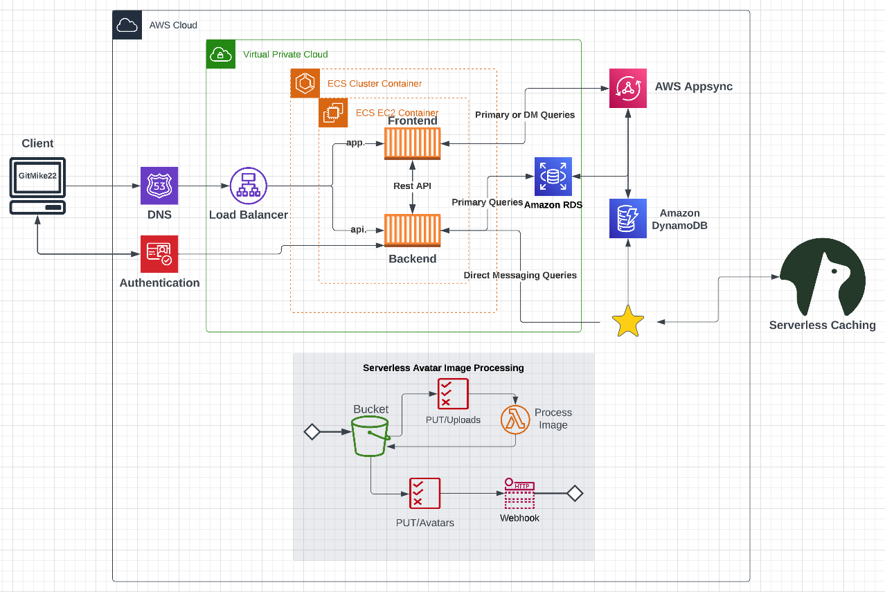

# Week 0 - Billing & Architecture
Overall learned a lot through trial and error with Github/Gitpod, AWS CLI(for creating services using JSON), was fun and looking forward to the next few weeks! 
## Required Homework/ Tasks

Napkin picture link: https://lucid.app/lucidchart/e72d7f7a-4b7b-4c05-b455-3a850484aa8f/edit?viewport_loc=-220%2C17%2C2036%2C1065%2C0_0&invitationId=inv_4f88b803-ace0-4624-a45e-af219a02cb53

## Logical Diagram Picture

**Link to MY Chart:** https://lucid.app/lucidchart/2adfee85-abb8-403c-a003-b82eb37aba30/edit?viewport_loc=-103%2C6%2C2167%2C1198%2C0_0&invitationId=inv_119f8b41-fdb7-4cce-9c43-68cf4775bee2

##                **DAILY JOURNAL**
### **11Feb**
Watched and rewatched live session. Took Notes.

### **12Feb**
Rewatched parts of live session and followed along.

### **13Feb**
Got through most of the extra videos for billing budget set up, took me awhile because i had to stop and go do things in between and would come back to realize all my progress was lost. So I had to redo my environment a couple times due to that, atleast until i got to the portion where we added commands that would save out settings.

### **14Feb**
Completed watching all the main videos, and completed all the set up for my account. Learned some AWS CLI and where to find the rest of the commands as well as examples! very helpful!

### **15Feb** 
Worked on and completed Logical Architectual Diagram on Lucid Chart. Took me awhile to get the hang of it, but once i figured it out it got more fun! tweaked it a bit to make it mine. I still had issues with the momento SVG, i somehow lost the eyeball so i just used a circle shape with the same color(No one can notice). I followed along with the chart diagram video for most of it. Looking forward for more. I plan on watching Chirag and Ashishs videos tomorrow and complete the quiz as well! Cheers!
### **16FEB**
Finally completed the Logical Diagram on Lucid Chart and uploaded it to Github and updated this journal with all the info! Started adding these detailed log days. I will continue this format as it helps me with logging what i learned even if its a quick sentence.
### **17FEB**
Finished watching Security and Spend considerations videos and completed quizzes. Wrote in the portal my overall assessment of my homework.
### **18FEB**
Morning: Completed Napkin and uploaded to Journal and checked it off checklist! (Last Item for the week!)
